# Disproof of 'Throughput Bonus' or 'Fast-Lane' Objection

This page is alo available as a set of slides [[PDF](202205-ThruputBonusDisproof.pdf)].

## Background

* The [objection](https://sce.dnsmgr.net/downloads/L4S-WGLC2-objection-details.pdf) (p4-5) claimed the [DualQ](https://datatracker.ietf.org/doc/html/draft-ietf-tsvwg-aqm-dualq-coupled) offers a 'fast-lane' or 'throughput bonus' and  
   "the bonus is easily exploited by unscrupulous senders without disabling congestion control"  
* These claims were based on:
  * a single experiment run with
  * no control experiment to check whether the alleged 'fast lane' was any faster than the other lane
* The following experiments aim to reproduce the objectors' experiment precisely 
  * and to add control experiments

## Experiment A. 2 CUBIC flows; 1 "tweaked" flow joins after 10s

| Setup | Results |
|-------|---------|
| 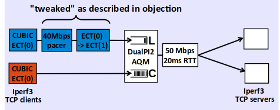 | 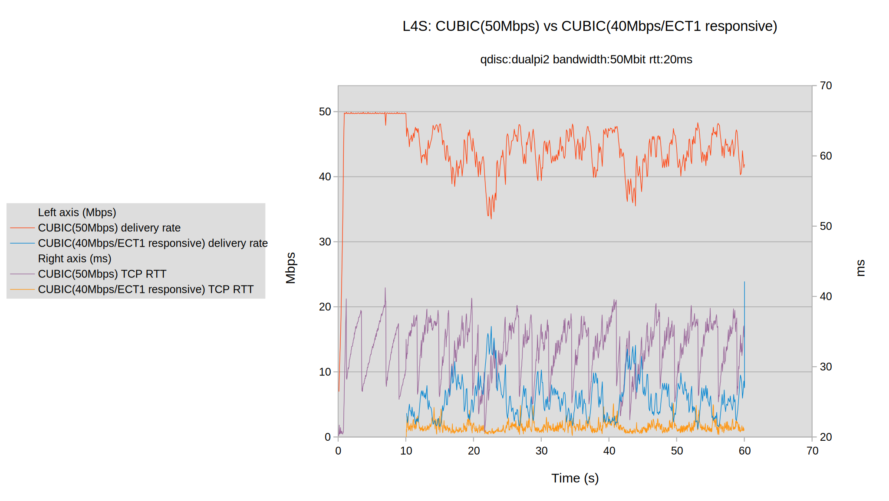 |
|       | <ul><li>Does not reproduce objection</li><li>Tweaked flow gets significantly smaller capacity share (blue), not larger</li></ul> |

## Experiment B. Tweaked flow then also made unresponsive

| Setup | Results |
|-------|---------|
| 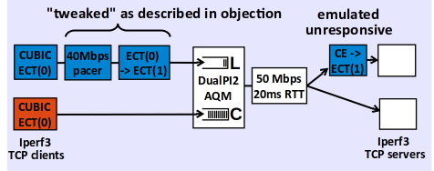 | 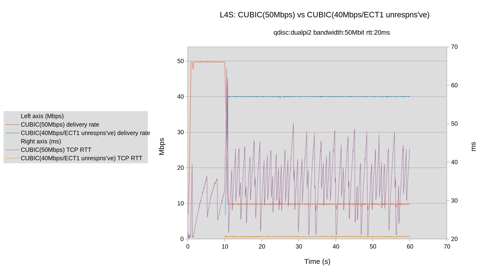 |
|       | <ul><li>Reproduces objection very closely</li><ul><li>but objection claimed cong. ctrl was not disabled</li></ul><li>Tweaked flow now gets 40Mbps (blue)</li><ul><li>as expected for 40Mbps paced unrespns've flow</li></ul></ul> |

| Setup | Results from objection for comparison |
|-------|---------------------------------------|
| Only described at high level - no response to repeated requests for clarification | 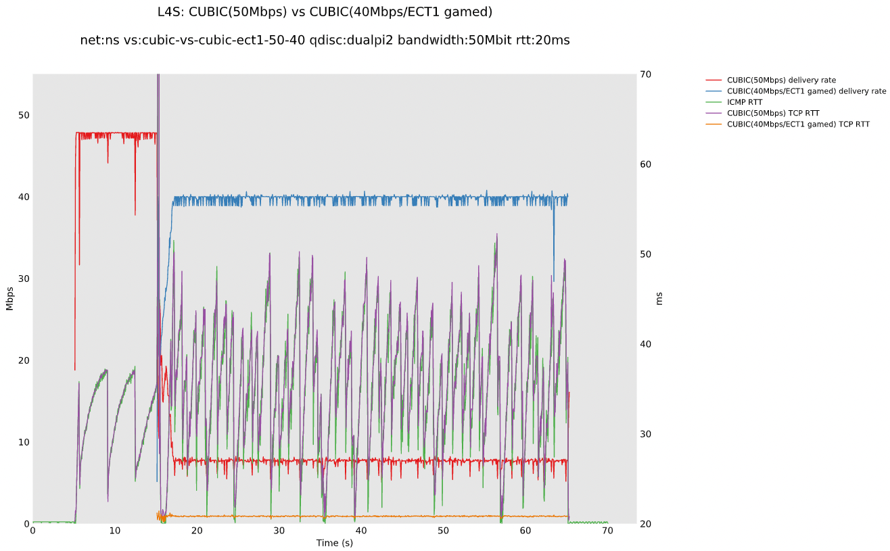 |

## Control experiment C.: Tweaked flow unresponsive but ECT(0)

| Setup | Results |
|-------|---------|
| 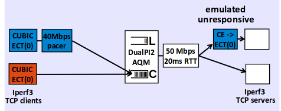 | 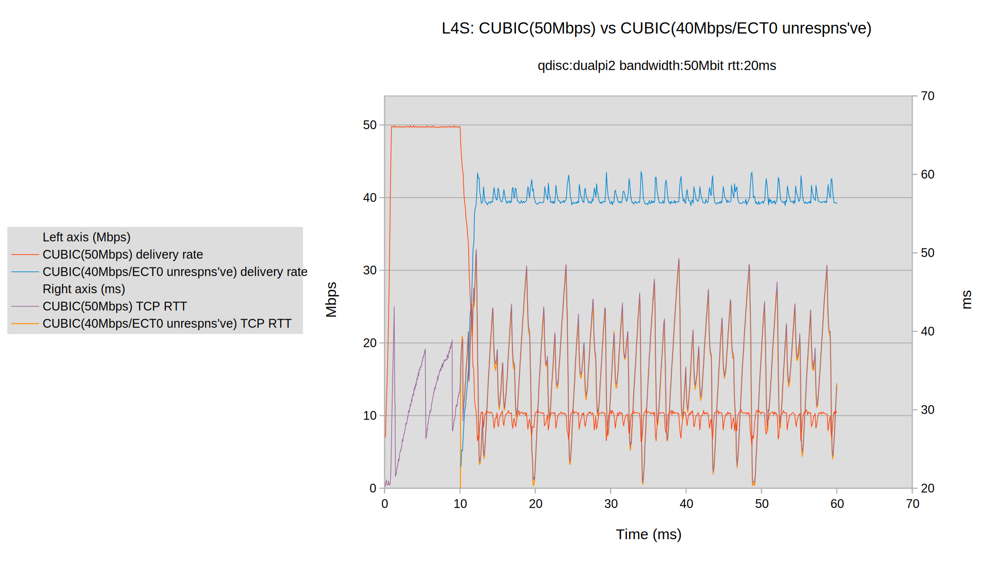 |
|       | <ul><li>Proves thru'put advantage is due to unresponsiveness, not DualPI2</li><li>because tweaked flow (blue) gets same advantage in either queue</li></ul> |

## Summary

* No evidence for objectors' 'fast-lane' claim by reproducing their experiment
* The result can be reproduced v closely by suppressing congestion control
  * But objectors stated "bonus is easily exploited ... without disabling congestion control"
  * Objectors' experiment was likely faulty, and somehow suppressed congestion control 
* Our experiments include a control run 
  * Claimed 'fast lane' is no faster than the other lane
  * Dual Queue Coupled AQM meets its stated goal of not allowing unresponsive flows to cause more harm to existing traffic than in a single queue
    * unresponsive thru'put: same in either queue
    * unresponsive delay: lower in L than C queue, but not at the expense of anyone else's delay
  
  
---
# Details In-Depth 

## Control experiment D.: Tweaked flow ECT(0) and responsive

| Setup | Results |
|-------|---------|
| 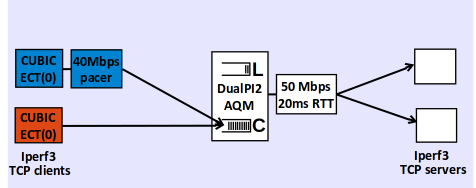 | 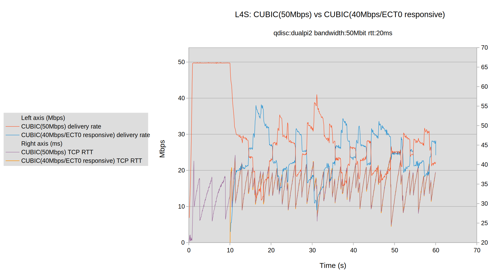 |
|       | <ul><li>Proves 40Mbps pacing is only a cap</li><li>Because tweaked flow behaves:</li><ul><li>as normal, given stable rate below 40Mb/s</li></ul></ul> |

## Experiment details

All nodes: 
* Ubuntu 18.04.4 LTS
* Linux kernel 5.10.31-3cc3851880a1-prague-37
* iproute2-5.9.0
* Commit ID: testing/[6e042bcd4158](https://github.com/L4STeam/linux/commit/6e042bcd4158)

## Inside experiment A: 2 CUBIC flows; 1 "tweaked"

| Setup | Results |
|-------|---------|
|  |  |
|                                         | 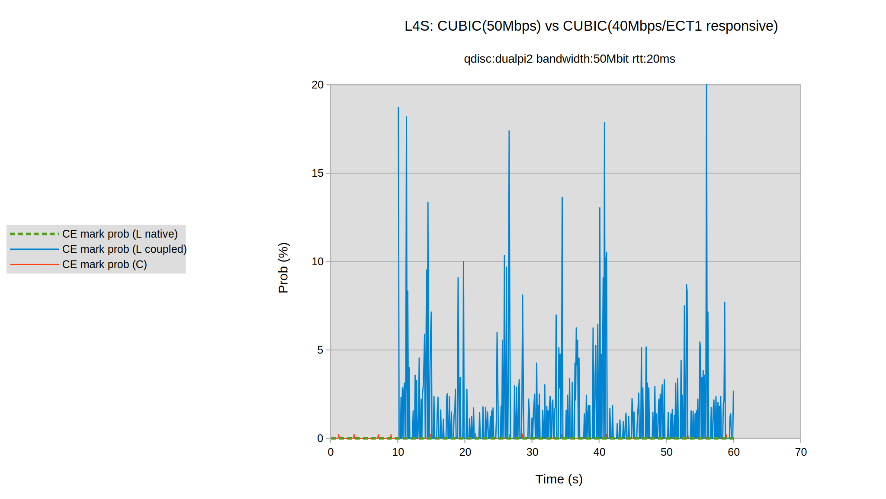 |
|       | <ul><li>Lower plot explains low thru'put of tweaked flow, due to its response to deliberately aggressive coupled marking (blue) instead of the Classic marking (red) intended for CUBIC</li><li>zero native L4S marking (green dashed)</li></ul> |

## Inside experiment B: Tweaked and unresponsive flow

| Setup | Results |
|-------|---------|
|  |  |
|                                         | 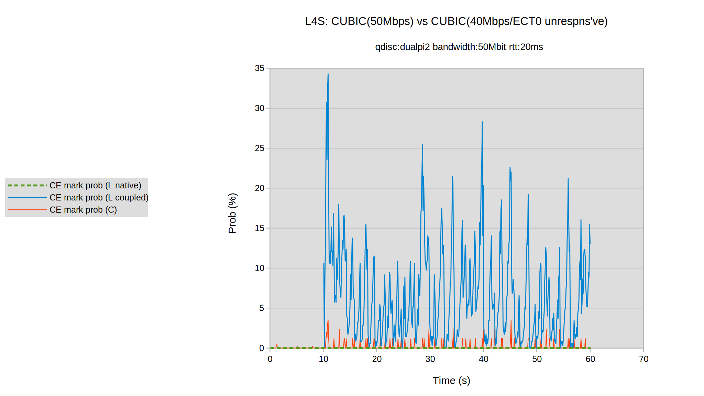 |
|       | <ul><li>Lower plot shows that the unresponsive L flow squeezes the C flow into less capacity by causing</li><ul><li>higher C congestion (red) and</li><li>in turn, higher coupled L congestion (blue) which it ignores</li></ul><li>Still zero native L4S marking (green dashed)</li></ul> |

---
Chia-Yu Chang (Nokia Bell Labs), [Koen De Schepper](https://www.bell-labs.com/about/researcher-profiles/koende_schepper/) (Nokia Bell Labs) and [Bob Briscoe](https://bobbriscoe.net/) (Independent)
