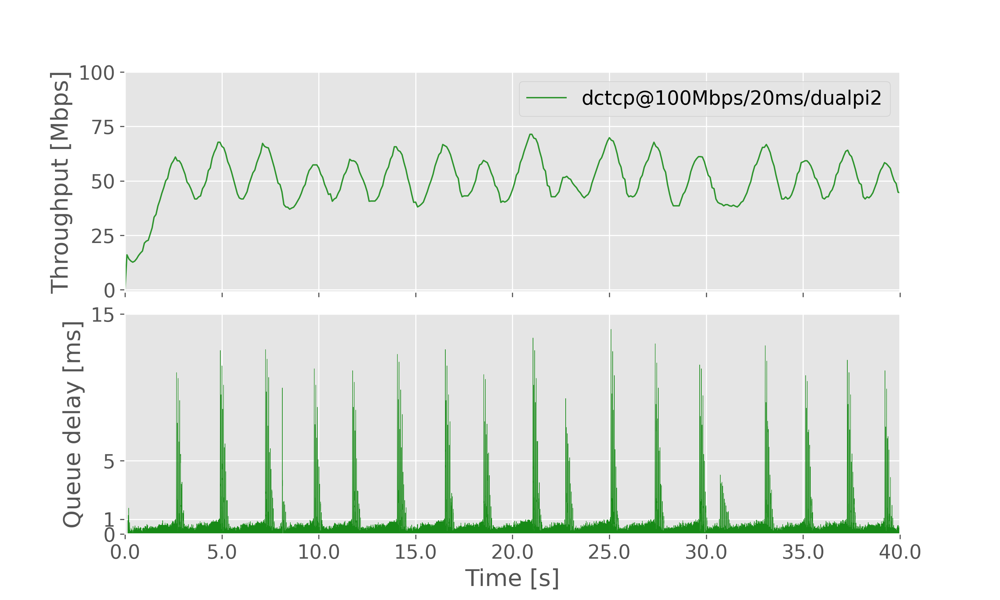

# Description

See the [test config file]({cfg}).

 * [Test-1: Prague vs [] at 20Mbit/5ms](#test-1-prague-vs-[]-at-20mbit/5ms)
 * [Test-2: Cubic vs [] at 20Mbit/5ms](#test-2-cubic-vs-[]-at-20mbit/5ms)
 * [Test-3: Prague vs [] at 20Mbit/20ms](#test-3-prague-vs-[]-at-20mbit/20ms)
 * [Test-4: Cubic vs [] at 20Mbit/20ms](#test-4-cubic-vs-[]-at-20mbit/20ms)
 * [Test-5: Prague vs [] at 20Mbit/40ms](#test-5-prague-vs-[]-at-20mbit/40ms)
 * [Test-6: Cubic vs [] at 20Mbit/40ms](#test-6-cubic-vs-[]-at-20mbit/40ms)
 * [Test-7: Prague vs [] at 20Mbit/80ms](#test-7-prague-vs-[]-at-20mbit/80ms)
 * [Test-8: Cubic vs [] at 20Mbit/80ms](#test-8-cubic-vs-[]-at-20mbit/80ms)
 * [Test-9: Prague vs [] at 100Mbit/5ms](#test-9-prague-vs-[]-at-100mbit/5ms)
 * [Test-10: Cubic vs [] at 100Mbit/5ms](#test-10-cubic-vs-[]-at-100mbit/5ms)
 * [Test-11: Prague vs [] at 100Mbit/20ms](#test-11-prague-vs-[]-at-100mbit/20ms)
 * [Test-12: Cubic vs [] at 100Mbit/20ms](#test-12-cubic-vs-[]-at-100mbit/20ms)
 * [Test-13: Prague vs [] at 100Mbit/40ms](#test-13-prague-vs-[]-at-100mbit/40ms)
 * [Test-14: Cubic vs [] at 100Mbit/40ms](#test-14-cubic-vs-[]-at-100mbit/40ms)
 * [Test-15: Prague vs [] at 100Mbit/80ms](#test-15-prague-vs-[]-at-100mbit/80ms)
 * [Test-16: Cubic vs [] at 100Mbit/80ms](#test-16-cubic-vs-[]-at-100mbit/80ms)
 * [Test-17: Prague vs [] at 500Mbit/5ms](#test-17-prague-vs-[]-at-500mbit/5ms)
 * [Test-18: Cubic vs [] at 500Mbit/5ms](#test-18-cubic-vs-[]-at-500mbit/5ms)
 * [Test-19: Prague vs [] at 500Mbit/20ms](#test-19-prague-vs-[]-at-500mbit/20ms)
 * [Test-20: Cubic vs [] at 500Mbit/20ms](#test-20-cubic-vs-[]-at-500mbit/20ms)
 * [Test-21: Prague vs [] at 500Mbit/40ms](#test-21-prague-vs-[]-at-500mbit/40ms)
 * [Test-22: Cubic vs [] at 500Mbit/40ms](#test-22-cubic-vs-[]-at-500mbit/40ms)
 * [Test-23: Prague vs [] at 500Mbit/80ms](#test-23-prague-vs-[]-at-500mbit/80ms)
 * [Test-24: Cubic vs [] at 500Mbit/80ms](#test-24-cubic-vs-[]-at-500mbit/80ms)
 * [Test-25: DCTCP vs [] at 100Mbit/20ms](#test-25-dctcp-vs-[]-at-100mbit/20ms)
 * [Test-26: Prague0d5 vs ['Prague1', 'Prague10', 'Prague30'] at 400Mbit/0ms](#test-26-prague0d5-vs-['prague1',-'prague10',-'prague30']-at-400mbit/0ms)
 * [Test-27: Cubic0d5 vs ['Cubic1', 'Cubic10', 'Cubic30'] at 400Mbit/0ms](#test-27-cubic0d5-vs-['cubic1',-'cubic10',-'cubic30']-at-400mbit/0ms)
 * [Test-28: Cubic vs ['Prague'] at 100Mbit/20ms](#test-28-cubic-vs-['prague']-at-100mbit/20ms)
 * [Test-29: Prague vs ['Cubic'] at 100Mbit/20ms](#test-29-prague-vs-['cubic']-at-100mbit/20ms)

# Test-1: Prague vs [] at 20Mbit/5ms

RTT: 5ms

BW: 20Mbit

AQM: dualpi2

CCA for flow (1): prague

[Go back to index](#description)

# Test-2: Cubic vs [] at 20Mbit/5ms

RTT: 5ms

BW: 20Mbit

AQM: fq_codel_tst

CCA for flow (1): cubic

[Go back to index](#description)

# Test-3: Prague vs [] at 20Mbit/20ms

RTT: 20ms

BW: 20Mbit

AQM: dualpi2

CCA for flow (1): prague

[Go back to index](#description)

# Test-4: Cubic vs [] at 20Mbit/20ms

RTT: 20ms

BW: 20Mbit

AQM: fq_codel_tst

CCA for flow (1): cubic

[Go back to index](#description)

# Test-5: Prague vs [] at 20Mbit/40ms

RTT: 40ms

BW: 20Mbit

AQM: dualpi2

CCA for flow (1): prague

[Go back to index](#description)

# Test-6: Cubic vs [] at 20Mbit/40ms

RTT: 40ms

BW: 20Mbit

AQM: fq_codel_tst

CCA for flow (1): cubic

[Go back to index](#description)

# Test-7: Prague vs [] at 20Mbit/80ms

RTT: 80ms

BW: 20Mbit

AQM: dualpi2

CCA for flow (1): prague

[Go back to index](#description)

# Test-8: Cubic vs [] at 20Mbit/80ms

RTT: 80ms

BW: 20Mbit

AQM: fq_codel_tst

CCA for flow (1): cubic

[Go back to index](#description)

# Test-9: Prague vs [] at 100Mbit/5ms

RTT: 5ms

BW: 100Mbit

AQM: dualpi2

CCA for flow (1): prague

[Go back to index](#description)

# Test-10: Cubic vs [] at 100Mbit/5ms

RTT: 5ms

BW: 100Mbit

AQM: fq_codel_tst

CCA for flow (1): cubic

[Go back to index](#description)

# Test-11: Prague vs [] at 100Mbit/20ms

RTT: 20ms

BW: 100Mbit

AQM: dualpi2

CCA for flow (1): prague

[Go back to index](#description)

# Test-12: Cubic vs [] at 100Mbit/20ms

RTT: 20ms

BW: 100Mbit

AQM: fq_codel_tst

CCA for flow (1): cubic

[Go back to index](#description)

# Test-13: Prague vs [] at 100Mbit/40ms

RTT: 40ms

BW: 100Mbit

AQM: dualpi2

CCA for flow (1): prague

[Go back to index](#description)

# Test-14: Cubic vs [] at 100Mbit/40ms

RTT: 40ms

BW: 100Mbit

AQM: fq_codel_tst

CCA for flow (1): cubic

[Go back to index](#description)

# Test-15: Prague vs [] at 100Mbit/80ms

RTT: 80ms

BW: 100Mbit

AQM: dualpi2

CCA for flow (1): prague

[Go back to index](#description)

# Test-16: Cubic vs [] at 100Mbit/80ms

RTT: 80ms

BW: 100Mbit

AQM: fq_codel_tst

CCA for flow (1): cubic

[Go back to index](#description)

# Test-17: Prague vs [] at 500Mbit/5ms

RTT: 5ms

BW: 500Mbit

AQM: dualpi2

CCA for flow (1): prague

[Go back to index](#description)

# Test-18: Cubic vs [] at 500Mbit/5ms

RTT: 5ms

BW: 500Mbit

AQM: fq_codel_tst

CCA for flow (1): cubic

[Go back to index](#description)

# Test-19: Prague vs [] at 500Mbit/20ms

RTT: 20ms

BW: 500Mbit

AQM: dualpi2

CCA for flow (1): prague

[Go back to index](#description)

# Test-20: Cubic vs [] at 500Mbit/20ms

RTT: 20ms

BW: 500Mbit

AQM: fq_codel_tst

CCA for flow (1): cubic

[Go back to index](#description)

# Test-21: Prague vs [] at 500Mbit/40ms

RTT: 40ms

BW: 500Mbit

AQM: dualpi2

CCA for flow (1): prague

[Go back to index](#description)

# Test-22: Cubic vs [] at 500Mbit/40ms

RTT: 40ms

BW: 500Mbit

AQM: fq_codel_tst

CCA for flow (1): cubic

[Go back to index](#description)

# Test-23: Prague vs [] at 500Mbit/80ms

RTT: 80ms

BW: 500Mbit

AQM: dualpi2

CCA for flow (1): prague

[Go back to index](#description)

# Test-24: Cubic vs [] at 500Mbit/80ms

RTT: 80ms

BW: 500Mbit

AQM: fq_codel_tst

CCA for flow (1): cubic

[Go back to index](#description)

# Test-25: DCTCP vs [] at 100Mbit/20ms

RTT: 20ms

BW: 100Mbit

AQM: dualpi2

CCA for flow (1): dctcp

[Go back to index](#description)

# Test-26: Prague0d5 vs ['Prague1', 'Prague10', 'Prague30'] at 400Mbit/0ms

RTT: 0ms

BW: 400Mbit

AQM: dualpi2

CCA for flow (1): prague
CCA for flow (2): pragueCCA for flow (3): pragueCCA for flow (4): prague

[Go back to index](#description)

# Test-27: Cubic0d5 vs ['Cubic1', 'Cubic10', 'Cubic30'] at 400Mbit/0ms

RTT: 0ms

BW: 400Mbit

AQM: fq_codel_tst

CCA for flow (1): cubic
CCA for flow (2): cubicCCA for flow (3): cubicCCA for flow (4): cubic

[Go back to index](#description)

# Test-28: Cubic vs ['Prague'] at 100Mbit/20ms

RTT: 20ms

BW: 100Mbit

AQM: fq_codel_tst

CCA for flow (1): cubic
CCA for flow (2): prague

[Go back to index](#description)

# Test-29: Prague vs ['Cubic'] at 100Mbit/20ms

RTT: 20ms

BW: 100Mbit

AQM: dualpi2

CCA for flow (1): prague
CCA for flow (2): cubic

[Go back to index](#description)
