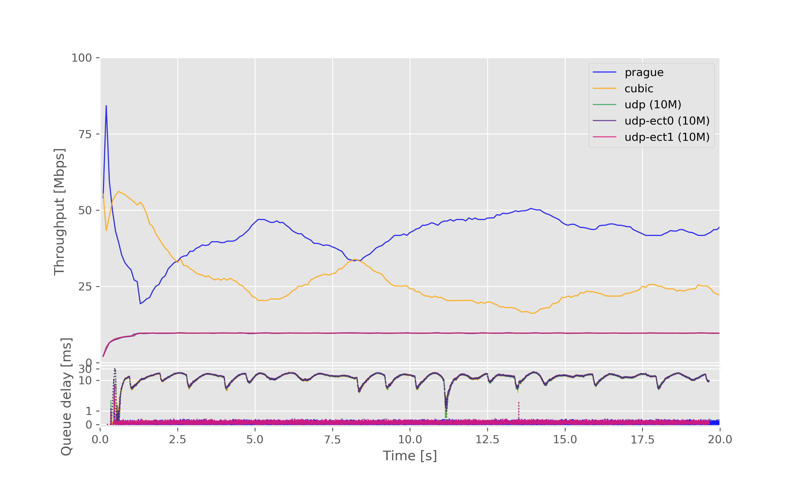
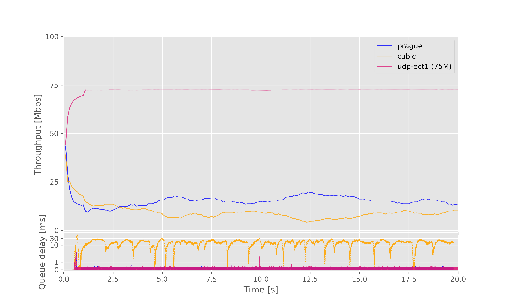

# Description

Tests run on a `100Mbps` bottleneck, with a `20.0ms` base RTT.

AQM in use: `dualpi2 classic_protection 0%`

See the [test config file](test_cfg.json).

 * [Test-1: Prague vs Cubic with a background load of udp (10M)](#test-1-prague-vs-cubic-with-a-background-load-of-udp-10m)
 * [Test-2: Prague vs Cubic with a background load of udp-ect0 (10M)](#test-2-prague-vs-cubic-with-a-background-load-of-udp-ect0-10m)
 * [Test-3: Prague vs Cubic with a background load of udp-ect1 (10M)](#test-3-prague-vs-cubic-with-a-background-load-of-udp-ect1-10m)
 * [Test-4: Prague vs Cubic with a background load of udp (10M) and udp-ect0 (10M)](#test-4-prague-vs-cubic-with-a-background-load-of-udp-10m-and-udp-ect0-10m)
 * [Test-5: Prague vs Cubic with a background load of udp (10M) and udp-ect1 (10M)](#test-5-prague-vs-cubic-with-a-background-load-of-udp-10m-and-udp-ect1-10m)
 * [Test-6: Prague vs Cubic with a background load of udp-ect0 (10M) and udp-ect1 (10M)](#test-6-prague-vs-cubic-with-a-background-load-of-udp-ect0-10m-and-udp-ect1-10m)
 * [Test-7: Prague vs Cubic with a background load of udp (10M) and udp-ect0 (10M) and udp-ect1 (10M)](#test-7-prague-vs-cubic-with-a-background-load-of-udp-10m-and-udp-ect0-10m-and-udp-ect1-10m)
 * [Test-8: Prague vs Cubic with a background load of udp (20M)](#test-8-prague-vs-cubic-with-a-background-load-of-udp-20m)
 * [Test-9: Prague vs Cubic with a background load of udp-ect0 (20M)](#test-9-prague-vs-cubic-with-a-background-load-of-udp-ect0-20m)
 * [Test-10: Prague vs Cubic with a background load of udp-ect1 (20M)](#test-10-prague-vs-cubic-with-a-background-load-of-udp-ect1-20m)
 * [Test-11: Prague vs Cubic with a background load of udp (20M) and udp-ect0 (20M)](#test-11-prague-vs-cubic-with-a-background-load-of-udp-20m-and-udp-ect0-20m)
 * [Test-12: Prague vs Cubic with a background load of udp (20M) and udp-ect1 (20M)](#test-12-prague-vs-cubic-with-a-background-load-of-udp-20m-and-udp-ect1-20m)
 * [Test-13: Prague vs Cubic with a background load of udp-ect0 (20M) and udp-ect1 (20M)](#test-13-prague-vs-cubic-with-a-background-load-of-udp-ect0-20m-and-udp-ect1-20m)
 * [Test-14: Prague vs Cubic with a background load of udp (20M) and udp-ect0 (20M) and udp-ect1 (20M)](#test-14-prague-vs-cubic-with-a-background-load-of-udp-20m-and-udp-ect0-20m-and-udp-ect1-20m)
 * [Test-15: Prague vs Cubic with a background load of udp (50M)](#test-15-prague-vs-cubic-with-a-background-load-of-udp-50m)
 * [Test-16: Prague vs Cubic with a background load of udp-ect0 (50M)](#test-16-prague-vs-cubic-with-a-background-load-of-udp-ect0-50m)
 * [Test-17: Prague vs Cubic with a background load of udp-ect1 (50M)](#test-17-prague-vs-cubic-with-a-background-load-of-udp-ect1-50m)
 * [Test-18: Prague vs Cubic with a background load of udp (50M) and udp-ect0 (50M)](#test-18-prague-vs-cubic-with-a-background-load-of-udp-50m-and-udp-ect0-50m)
 * [Test-19: Prague vs Cubic with a background load of udp (50M) and udp-ect1 (50M)](#test-19-prague-vs-cubic-with-a-background-load-of-udp-50m-and-udp-ect1-50m)
 * [Test-20: Prague vs Cubic with a background load of udp-ect0 (50M) and udp-ect1 (50M)](#test-20-prague-vs-cubic-with-a-background-load-of-udp-ect0-50m-and-udp-ect1-50m)
 * [Test-21: Prague vs Cubic with a background load of udp (50M) and udp-ect0 (50M) and udp-ect1 (50M)](#test-21-prague-vs-cubic-with-a-background-load-of-udp-50m-and-udp-ect0-50m-and-udp-ect1-50m)
 * [Test-22: Prague vs Cubic with a background load of udp (75M)](#test-22-prague-vs-cubic-with-a-background-load-of-udp-75m)
 * [Test-23: Prague vs Cubic with a background load of udp-ect0 (75M)](#test-23-prague-vs-cubic-with-a-background-load-of-udp-ect0-75m)
 * [Test-24: Prague vs Cubic with a background load of udp-ect1 (75M)](#test-24-prague-vs-cubic-with-a-background-load-of-udp-ect1-75m)
 * [Test-25: Prague vs Cubic with a background load of udp (75M) and udp-ect0 (75M)](#test-25-prague-vs-cubic-with-a-background-load-of-udp-75m-and-udp-ect0-75m)
 * [Test-26: Prague vs Cubic with a background load of udp (75M) and udp-ect1 (75M)](#test-26-prague-vs-cubic-with-a-background-load-of-udp-75m-and-udp-ect1-75m)
 * [Test-27: Prague vs Cubic with a background load of udp-ect0 (75M) and udp-ect1 (75M)](#test-27-prague-vs-cubic-with-a-background-load-of-udp-ect0-75m-and-udp-ect1-75m)
 * [Test-28: Prague vs Cubic with a background load of udp (75M) and udp-ect0 (75M) and udp-ect1 (75M)](#test-28-prague-vs-cubic-with-a-background-load-of-udp-75m-and-udp-ect0-75m-and-udp-ect1-75m)
 * [Test-29: Prague vs Cubic with a background load of udp (100M)](#test-29-prague-vs-cubic-with-a-background-load-of-udp-100m)
 * [Test-30: Prague vs Cubic with a background load of udp-ect0 (100M)](#test-30-prague-vs-cubic-with-a-background-load-of-udp-ect0-100m)
 * [Test-31: Prague vs Cubic with a background load of udp-ect1 (100M)](#test-31-prague-vs-cubic-with-a-background-load-of-udp-ect1-100m)
 * [Test-32: Prague vs Cubic with a background load of udp (100M) and udp-ect0 (100M)](#test-32-prague-vs-cubic-with-a-background-load-of-udp-100m-and-udp-ect0-100m)
 * [Test-33: Prague vs Cubic with a background load of udp (100M) and udp-ect1 (100M)](#test-33-prague-vs-cubic-with-a-background-load-of-udp-100m-and-udp-ect1-100m)
 * [Test-34: Prague vs Cubic with a background load of udp-ect0 (100M) and udp-ect1 (100M)](#test-34-prague-vs-cubic-with-a-background-load-of-udp-ect0-100m-and-udp-ect1-100m)
 * [Test-35: Prague vs Cubic with a background load of udp (100M) and udp-ect0 (100M) and udp-ect1 (100M)](#test-35-prague-vs-cubic-with-a-background-load-of-udp-100m-and-udp-ect0-100m-and-udp-ect1-100m)

# Test-1: Prague vs Cubic with a background load of udp (10M)

CCA for flow (1): prague

CCA for flow (2): cubic

Background load: udp (10M)

[Go back to index](#description)

# Test-2: Prague vs Cubic with a background load of udp-ect0 (10M)

CCA for flow (1): prague

CCA for flow (2): cubic

Background load: udp-ect0 (10M)

[Go back to index](#description)

# Test-3: Prague vs Cubic with a background load of udp-ect1 (10M)

CCA for flow (1): prague

CCA for flow (2): cubic

Background load: udp-ect1 (10M)

[Go back to index](#description)

# Test-4: Prague vs Cubic with a background load of udp (10M) and udp-ect0 (10M)

CCA for flow (1): prague

CCA for flow (2): cubic

Background load: udp (10M), udp-ect0 (10M)

[Go back to index](#description)

# Test-5: Prague vs Cubic with a background load of udp (10M) and udp-ect1 (10M)

CCA for flow (1): prague

CCA for flow (2): cubic

Background load: udp (10M), udp-ect1 (10M)

[Go back to index](#description)

# Test-6: Prague vs Cubic with a background load of udp-ect0 (10M) and udp-ect1 (10M)

CCA for flow (1): prague

CCA for flow (2): cubic

Background load: udp-ect0 (10M), udp-ect1 (10M)

[Go back to index](#description)

# Test-7: Prague vs Cubic with a background load of udp (10M) and udp-ect0 (10M) and udp-ect1 (10M)

CCA for flow (1): prague

CCA for flow (2): cubic

Background load: udp (10M), udp-ect0 (10M), udp-ect1 (10M)

[Go back to index](#description)

# Test-8: Prague vs Cubic with a background load of udp (20M)

CCA for flow (1): prague

CCA for flow (2): cubic

Background load: udp (20M)

[Go back to index](#description)

# Test-9: Prague vs Cubic with a background load of udp-ect0 (20M)

CCA for flow (1): prague

CCA for flow (2): cubic

Background load: udp-ect0 (20M)

[Go back to index](#description)

# Test-10: Prague vs Cubic with a background load of udp-ect1 (20M)

CCA for flow (1): prague

CCA for flow (2): cubic

Background load: udp-ect1 (20M)

[Go back to index](#description)

# Test-11: Prague vs Cubic with a background load of udp (20M) and udp-ect0 (20M)

CCA for flow (1): prague

CCA for flow (2): cubic

Background load: udp (20M), udp-ect0 (20M)

[Go back to index](#description)

# Test-12: Prague vs Cubic with a background load of udp (20M) and udp-ect1 (20M)

CCA for flow (1): prague

CCA for flow (2): cubic

Background load: udp (20M), udp-ect1 (20M)

[Go back to index](#description)

# Test-13: Prague vs Cubic with a background load of udp-ect0 (20M) and udp-ect1 (20M)

CCA for flow (1): prague

CCA for flow (2): cubic

Background load: udp-ect0 (20M), udp-ect1 (20M)

[Go back to index](#description)

# Test-14: Prague vs Cubic with a background load of udp (20M) and udp-ect0 (20M) and udp-ect1 (20M)

CCA for flow (1): prague

CCA for flow (2): cubic

Background load: udp (20M), udp-ect0 (20M), udp-ect1 (20M)

[Go back to index](#description)

# Test-15: Prague vs Cubic with a background load of udp (50M)

CCA for flow (1): prague

CCA for flow (2): cubic

Background load: udp (50M)

[Go back to index](#description)

# Test-16: Prague vs Cubic with a background load of udp-ect0 (50M)

CCA for flow (1): prague

CCA for flow (2): cubic

Background load: udp-ect0 (50M)

[Go back to index](#description)

# Test-17: Prague vs Cubic with a background load of udp-ect1 (50M)

CCA for flow (1): prague

CCA for flow (2): cubic

Background load: udp-ect1 (50M)

[Go back to index](#description)

# Test-18: Prague vs Cubic with a background load of udp (50M) and udp-ect0 (50M)

CCA for flow (1): prague

CCA for flow (2): cubic

Background load: udp (50M), udp-ect0 (50M)

[Go back to index](#description)

# Test-19: Prague vs Cubic with a background load of udp (50M) and udp-ect1 (50M)

CCA for flow (1): prague

CCA for flow (2): cubic

Background load: udp (50M), udp-ect1 (50M)

[Go back to index](#description)

# Test-20: Prague vs Cubic with a background load of udp-ect0 (50M) and udp-ect1 (50M)

CCA for flow (1): prague

CCA for flow (2): cubic

Background load: udp-ect0 (50M), udp-ect1 (50M)

[Go back to index](#description)

# Test-21: Prague vs Cubic with a background load of udp (50M) and udp-ect0 (50M) and udp-ect1 (50M)

CCA for flow (1): prague

CCA for flow (2): cubic

Background load: udp (50M), udp-ect0 (50M), udp-ect1 (50M)

[Go back to index](#description)

# Test-22: Prague vs Cubic with a background load of udp (75M)

CCA for flow (1): prague

CCA for flow (2): cubic

Background load: udp (75M)

[Go back to index](#description)

# Test-23: Prague vs Cubic with a background load of udp-ect0 (75M)

CCA for flow (1): prague

CCA for flow (2): cubic

Background load: udp-ect0 (75M)

[Go back to index](#description)

# Test-24: Prague vs Cubic with a background load of udp-ect1 (75M)

CCA for flow (1): prague

CCA for flow (2): cubic

Background load: udp-ect1 (75M)

[Go back to index](#description)

# Test-25: Prague vs Cubic with a background load of udp (75M) and udp-ect0 (75M)

CCA for flow (1): prague

CCA for flow (2): cubic

Background load: udp (75M), udp-ect0 (75M)

[Go back to index](#description)

# Test-26: Prague vs Cubic with a background load of udp (75M) and udp-ect1 (75M)

CCA for flow (1): prague

CCA for flow (2): cubic

Background load: udp (75M), udp-ect1 (75M)

[Go back to index](#description)

# Test-27: Prague vs Cubic with a background load of udp-ect0 (75M) and udp-ect1 (75M)

CCA for flow (1): prague

CCA for flow (2): cubic

Background load: udp-ect0 (75M), udp-ect1 (75M)

[Go back to index](#description)

# Test-28: Prague vs Cubic with a background load of udp (75M) and udp-ect0 (75M) and udp-ect1 (75M)

CCA for flow (1): prague

CCA for flow (2): cubic

Background load: udp (75M), udp-ect0 (75M), udp-ect1 (75M)

[Go back to index](#description)

# Test-29: Prague vs Cubic with a background load of udp (100M)

CCA for flow (1): prague

CCA for flow (2): cubic

Background load: udp (100M)

[Go back to index](#description)

# Test-30: Prague vs Cubic with a background load of udp-ect0 (100M)

CCA for flow (1): prague

CCA for flow (2): cubic

Background load: udp-ect0 (100M)

[Go back to index](#description)

# Test-31: Prague vs Cubic with a background load of udp-ect1 (100M)

CCA for flow (1): prague

CCA for flow (2): cubic

Background load: udp-ect1 (100M)

[Go back to index](#description)

# Test-32: Prague vs Cubic with a background load of udp (100M) and udp-ect0 (100M)

CCA for flow (1): prague

CCA for flow (2): cubic

Background load: udp (100M), udp-ect0 (100M)

[Go back to index](#description)

# Test-33: Prague vs Cubic with a background load of udp (100M) and udp-ect1 (100M)

CCA for flow (1): prague

CCA for flow (2): cubic

Background load: udp (100M), udp-ect1 (100M)

[Go back to index](#description)

# Test-34: Prague vs Cubic with a background load of udp-ect0 (100M) and udp-ect1 (100M)

CCA for flow (1): prague

CCA for flow (2): cubic

Background load: udp-ect0 (100M), udp-ect1 (100M)

[Go back to index](#description)

# Test-35: Prague vs Cubic with a background load of udp (100M) and udp-ect0 (100M) and udp-ect1 (100M)

CCA for flow (1): prague

CCA for flow (2): cubic

Background load: udp (100M), udp-ect0 (100M), udp-ect1 (100M)

[Go back to index](#description)
