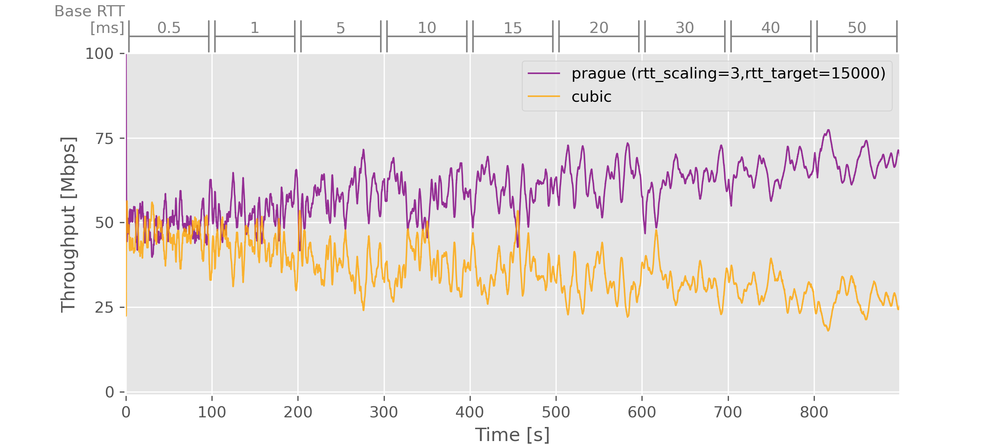

# Description

Tests run on a `100Mbps` bottleneck. The applied delay changed every 100s.

See the [test config file](test_cfg.json).

 * [Test-1: Prague vs Cubic](#test-1-prague-vs-cubic)
 * [Test-2: PragueRTTIndep vs Cubic](#test-2-praguerttindep-vs-cubic)
 * [Test-3: PragueRTTIndepAdditive vs Cubic](#test-3-praguerttindepadditive-vs-cubic)
 * [Test-4: PragueRTTIndep vs Prague](#test-4-praguerttindep-vs-prague)

# Test-1: Prague vs Cubic

CCA for flow (1): prague (rtt_scaling=0,rtt_target=15000)

CCA for flow (2): cubic

Varying Base RTT
[ms] in `[0.5, 1.0, 5.0, 10.0, 15.0, 20.0, 30.0, 40.0, 50.0]`

[Go back to index](#description)

# Test-2: PragueRTTIndep vs Cubic

CCA for flow (1): prague (rtt_scaling=1,rtt_target=15000)

CCA for flow (2): cubic

Varying Base RTT
[ms] in `[0.5, 1.0, 5.0, 10.0, 15.0, 20.0, 30.0, 40.0, 50.0]`

[Go back to index](#description)

# Test-3: PragueRTTIndepAdditive vs Cubic

CCA for flow (1): prague (rtt_scaling=3,rtt_target=15000)

CCA for flow (2): cubic

Varying Base RTT
[ms] in `[0.5, 1.0, 5.0, 10.0, 15.0, 20.0, 30.0, 40.0, 50.0]`

[Go back to index](#description)

# Test-4: PragueRTTIndep vs Prague

CCA for flow (1): prague (rtt_scaling=1,rtt_target=15000)

CCA for flow (2): prague (rtt_scaling=0,rtt_target=15000)

Varying Base RTT of
flow (1) [ms] in `[0.5, 1.0, 5.0, 10.0, 15.0, 20.0, 30.0, 40.0, 50.0]`

[Go back to index](#description)
